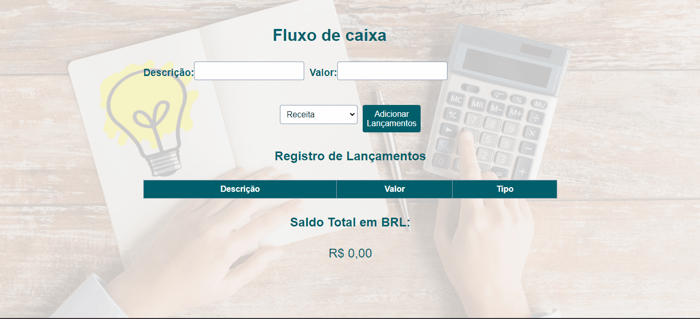

# Sistema de fluxo de caixa usando HTML, CSS E JavaScript.💰🧾

Esse foi meu primeiro projeto usando as três linguagens, comecei o projeto do zero, e ao longo do processo fui aprendendo e evoluindo meu conhecimento, nesse projeto eu aprendi também a como usar pela primeira vez comandos pelo Git Bash e realizar os meus commits e push com códigos. Sei que ainda tem muito a evoluir, mas me sinto muito feliz pelo meu primeiro projeto feito do zero. 

## Tecnologias utilizadas 💻
- HTML
- CSS
- JavaScript
- Git

